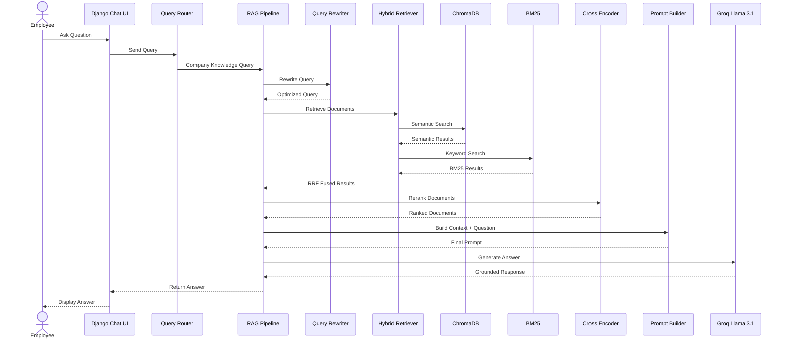
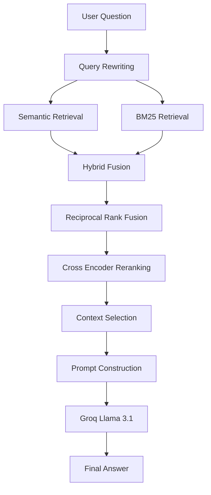

# RAGLink – Enterprise AI Knowledge Assistant


---

## 📌 Project Name

# RAGLink

### Enterprise AI Knowledge Assistant using Retrieval-Augmented Generation

---

## 💡 Project Idea

RAGLink is an enterprise knowledge assistant that allows employees to ask questions about company policies, HR documents, projects, technical documentation, and internal knowledge.

The system uses **Retrieval-Augmented Generation (RAG)** to retrieve relevant information from the company's knowledge base and generate context-aware answers.

Instead of relying only on an LLM's pre-trained knowledge, RAGLink retrieves relevant company documents and provides them as context to the LLM before generating the response.

This helps reduce hallucinations and ensures that answers are grounded in the organization's internal knowledge base.

---

## 🎯 Why RAGLink?

In an organization, employees often need to search through multiple documents to find information such as:

- Leave policies
- HR procedures
- Employee onboarding
- IT support processes
- Project documentation
- Technical architecture
- Company policies
- Learning and development information

RAGLink provides a centralized AI-powered interface where employees can ask questions in natural language.

### Example

**User Question:**

> What database does Project Meridian use?

**RAGLink Answer:**

> Project Meridian uses a MySQL 8.0 database schema.

---

# 🚀 Key Features

- 🔐 Role-based user authentication
- 👨‍💼 Admin dashboard
- 👨‍💻 Employee dashboard
- 👥 Team Lead access
- 📄 Enterprise document management
- 📚 Document ingestion and processing
- 🧠 HuggingFace embeddings
- 🔎 Semantic search using ChromaDB
- 🔤 Keyword search using BM25
- 🔀 Hybrid retrieval using Reciprocal Rank Fusion
- 🎯 Cross-Encoder reranking
- ✍️ Query rewriting
- 🤖 Groq Llama 3.1 LLM
- 🛡️ Context-grounded answer generation
- 🧮 Calculator tool
- 📅 Date and time tools
- 🌐 Web search tool
- 🧭 Query routing
- 🔄 LangGraph workflow foundation
- 🧪 Unit testing for major RAG components
- 💬 ChatGPT-style employee knowledge assistant

---

# 🛠️ Tech Stack

| Category | Technology |
|---|---|
| Programming Language | Python 3.13 |
| Web Framework | Django |
| Frontend | HTML, CSS, JavaScript |
| Database | MySQL |
| LLM | Groq Llama 3.1 |
| RAG | Retrieval-Augmented Generation |
| Embeddings | HuggingFace |
| Vector Database | ChromaDB |
| Sparse Retrieval | BM25 |
| Hybrid Retrieval | Reciprocal Rank Fusion (RRF) |
| Reranking | Cross-Encoder |
| AI Framework | LangChain |
| Workflow | LangGraph |
| Testing | Python unittest |
| Version Control | Git & GitHub |

---

# 🏗️ System Architecture

```mermaid
flowchart TD

    A[Employee] --> B[Django Web Application]

    B --> C[Authentication & Role Management]

    C --> D[Employee / Team Lead / Admin Dashboard]

    D --> E[Chat Interface]

    E --> F[Query Router]

    F --> G{Query Type}

    G -->|Company Knowledge| H[RAG Pipeline]
    G -->|Calculation| I[Calculator Tool]
    G -->|Date / Time| J[Date Tool]
    G -->|Web Query| K[Web Search Tool]

    H --> L[Query Rewriter]

    L --> M[Hybrid Retriever]

    M --> N[Semantic Retrieval]
    M --> O[BM25 Retrieval]

    N --> P[ChromaDB]
    O --> Q[BM25 Index]

    N --> R[Reciprocal Rank Fusion]
    O --> R

    R --> S[Cross Encoder Reranker]

    S --> T[Context Selection]

    T --> U[Prompt Builder]

    U --> V[Groq Llama 3.1]

    V --> W[Grounded Answer]

    W --> E
````

---

# 📄 Document Ingestion Flow

Documents uploaded to the knowledge base are processed before they can be used by the RAG system.

```mermaid
flowchart LR

    A[Company Documents] --> B[Document Loader]

    B --> C[Document Processor]

    C --> D[Text Extraction]

    D --> E[Chunking]

    E --> F[Text Chunks]

    F --> G[HuggingFace Embeddings]

    G --> H[Vector Embeddings]

    H --> I[ChromaDB]

    F --> J[BM25 Index]

    I --> K[Semantic Retrieval]
    J --> L[Keyword Retrieval]
```

### Supported Knowledge Sources

* PDF
* DOCX
* TXT
* Company policies
* HR documents
* Project documentation
* Technical documentation

---

# 🔍 RAG Query Flow

When an employee asks a question, RAGLink follows the following process:



---

# 🔄 RAG Pipeline



### RAG Pipeline Stages

1. **Query Rewriting**
   Converts the user's question into a retrieval-friendly query.

2. **Semantic Retrieval**
   Searches documents using vector similarity through ChromaDB.

3. **BM25 Retrieval**
   Performs keyword-based retrieval for exact terms and phrases.

4. **Hybrid Retrieval**
   Combines semantic and keyword search results using Reciprocal Rank Fusion.

5. **Reranking**
   Uses a Cross-Encoder model to identify the most relevant documents.

6. **Context Selection**
   Selects the most useful document chunks.

7. **Prompt Construction**
   Combines the user question with retrieved context.

8. **LLM Generation**
   Groq Llama 3.1 generates the final response using the retrieved context.

---

# 📂 Project Structure

```text
RAGLink/
│
├── accounts/                              # User authentication, roles, and account management
│   ├── migrations/                        # Database migrations for user/account models
│   ├── templates/                         # Account-related HTML templates
│   ├── __init__.py                         # Python package initializer
│   ├── admin.py                            # Registers account models in Django Admin
│   ├── apps.py                             # Django application configuration
│   ├── models.py                           # Custom User model and role definitions
│   ├── services.py                         # Account-related business logic
│   ├── tests.py                            # Account application tests
│   ├── urls.py                             # URL routes for account features
│   └── views.py                            # Login, logout, and account-related views
│
├── chatbot/                               # Chatbot application and RAG interaction layer
│   ├── migrations/                         # Chatbot database migrations
│   ├── templates/                          # Chatbot-specific HTML templates
│   ├── __init__.py                         # Python package initializer
│   ├── admin.py                            # Chatbot model administration
│   ├── apps.py                             # Django chatbot app configuration
│   ├── models.py                           # Chat and conversation data models
│   ├── services.py                         # Connects user queries with RAG pipeline and tools
│   ├── tests.py                            # Chatbot application tests
│   ├── urls.py                             # Chatbot URL routes
│   └── views.py                            # Handles chatbot requests and responses
│
├── chroma_db/                             # Persistent ChromaDB vector database
│
├── config/                                # Django project configuration
│
├── data/                                  # Processed data and generated intermediate files
│
├── documents/                             # Document management application
│
├── media/                                 # Uploaded company and project knowledge documents
│   ├── Company/                            # Company-wide policies, HR, IT, security, and technical documents
│   └── Projects/                           # Project-specific technical and project documentation
│
├── rag/                                   # Core Retrieval-Augmented Generation system
│   │
│   ├── evaluation/                         # RAG quality and evaluation-related components
│   │
│   ├── generation/                         # Query processing and answer generation
│   │   ├── __init__.py                     # Python package initializer
│   │   ├── context.py                      # Selects and builds relevant context for the LLM
│   │   ├── generator.py                    # Handles final answer generation
│   │   ├── llm.py                          # Groq LLM configuration and generation
│   │   ├── prompt.py                       # Builds grounded prompts using retrieved context
│   │   └── query_rewriter.py               # Rewrites user queries to improve retrieval
│   │
│   ├── ingestion/                          # Document ingestion and preprocessing pipeline
│   │   ├── __init__.py                     # Python package initializer
│   │   ├── ingest.py                       # Main document ingestion process
│   │   ├── loaders.py                      # Loads PDF, DOCX, TXT, and other supported documents
│   │   └── processor.py                    # Processes and prepares documents for indexing
│   │
│   ├── langgraph/                          # LangGraph workflow foundation
│   │   ├── __init__.py                     # Python package initializer
│   │   ├── graph.py                        # Defines the LangGraph workflow
│   │   ├── nodes.py                        # Defines individual workflow nodes
│   │   └── state.py                        # Defines shared workflow state
│   │
│   ├── retrieval/                          # Hybrid document retrieval system
│   │   ├── __init__.py                     # Python package initializer
│   │   ├── bm25.py                         # Keyword-based sparse retrieval using BM25
│   │   ├── hybrid.py                       # Combines semantic and BM25 retrieval using RRF
│   │   ├── rerank.py                       # Cross-encoder reranking of retrieved documents
│   │   └── retriever.py                    # Semantic similarity retrieval from ChromaDB
│   │
│   ├── tools/                              # Utility tools used by the chatbot
│   │   ├── __init__.py                     # Python package initializer
│   │   ├── calculator.py                   # Handles mathematical calculations
│   │   ├── date.py                         # Handles date and time-related queries
│   │   ├── query_router.py                 # Routes queries to RAG or appropriate tools
│   │   └── web_search.py                   # Handles supported web search queries
│   │
│   ├── vectorstore/                        # Vector database and embedding storage
│   │
│   ├── config.py                           # RAG configuration and pipeline settings
│   └── pipeline.py                         # Main RAG pipeline connecting all RAG components
│
├── requirements/                           # Project dependency configuration
│   └── requirements.txt                    # Python packages required to run the project
│
├── scripts/                                # Utility and manual testing scripts
│   ├── restore_documents.py                # Restores or reprocesses document data
│   ├── test_bm25_manual.py                 # Manually tests BM25 retrieval
│   ├── test_graph_manual.py                # Manually tests LangGraph workflow
│   ├── test_hybrid_manual.py               # Manually tests hybrid retrieval
│   ├── test_llm_manual.py                  # Manually tests LLM generation
│   ├── test_prompt_manual.py               # Manually tests prompt construction
│   ├── test_reranker_manual.py             # Manually tests document reranking
│   └── test_retriever_manual.py             # Manually tests semantic retrieval
│
├── templates/                              # Global Django HTML templates
│   ├── admin/                              # Admin dashboard and user management pages
│   │   ├── add_user.html                   # Admin page for creating users
│   │   ├── dashboard.html                  # Admin dashboard
│   │   ├── manage_users.html               # User management interface
│   │   └── reset_password.html              # Password reset interface
│   │
│   ├── documents/                          # Document management interface
│   │   └── manage_documents.html            # Upload and manage knowledge documents
│   │
│   ├── employee/                           # Employee interface
│   │   └── employee_dashboard.html          # Employee dashboard with RAGLink chatbot
│   │
│   ├── home/                               # Home page
│   │   └── index.html                      # Main landing page
│   │
│   ├── registration/                       # Authentication pages
│   │   ├── admin_login.html                # Admin login page
│   │   ├── employee_login.html             # Employee login page
│   │   └── teamlead_login.html             # Team Lead login page
│   │
│   ├── teamlead/                           # Team Lead interface
│   │
│   └── base.html                            # Common base template shared by pages
│
├── tests/                                  # Automated unit and integration tests
│   ├── test_bm25.py                        # Tests BM25 retrieval
│   ├── test_generation_quality.py          # Tests generated answer quality
│   ├── test_generation.py                  # Tests answer generation
│   ├── test_graph.py                       # Tests LangGraph workflow
│   ├── test_hybrid.py                      # Tests hybrid retrieval
│   ├── test_ingestion.py                   # Tests document ingestion
│   ├── test_llm.py                         # Tests LLM functionality
│   ├── test_pipeline.py                    # Tests complete RAG pipeline
│   ├── test_prompt.py                      # Tests prompt construction
│   ├── test_rag_quality.py                 # Tests RAG answers against expected answers
│   ├── test_reranker.py                    # Tests cross-encoder reranking
│   └── test_retriever.py                   # Tests semantic retrieval
│
├── .env                                    # Environment variables and API credentials
├── .gitignore                              # Files excluded from Git
├── manage.py                               # Django project command-line utility
└── README.md                               # Project documentation

```
# 🧪 Testing

RAGLink includes unit tests for major components of the system.

Run all tests using:

```bash
python -m unittest discover -s tests -p "test_*.py" -v
```

The project tests include:

* BM25 retrieval
* Semantic retrieval
* Hybrid retrieval
* Cross-Encoder reranking
* Document ingestion
* Prompt generation
* LLM generation
* RAG pipeline
* LangGraph workflow
* RAG answer quality

The current testing approach uses **Python unittest-based tests** and custom RAG quality checks.

---

# 🔐 Security

* Environment variables are used for API keys.
* Sensitive configuration is stored in `.env`.
* `.env` is excluded from Git using `.gitignore`.
* Role-based access is implemented for Admin, Team Lead, and Employee users.

---

# 🔮 Future Enhancements

* Improve retrieval accuracy for complex multi-part questions.
* Add better document metadata filtering.
* Improve source citation display.
* Add conversation memory.
* Add document-level access control.
* Add advanced analytics and user feedback.
* Improve query routing.
* Expand LangGraph workflow integration.
* Add automated RAG evaluation using dedicated evaluation frameworks.

---

# 👩‍💻 Project Summary

RAGLink demonstrates how enterprise documents can be combined with modern AI technologies to create a reliable internal knowledge assistant.

The system combines:

**Django + MySQL**
↓
**Document Ingestion**
↓
**HuggingFace Embeddings**
↓
**ChromaDB + BM25**
↓
**Hybrid Retrieval + RRF**
↓
**Cross-Encoder Reranking**
↓
**Context Selection**
↓
**Groq Llama 3.1**
↓
**Grounded Enterprise Answer**

---

## 📜 License

This project is licensed under the MIT License.

````
