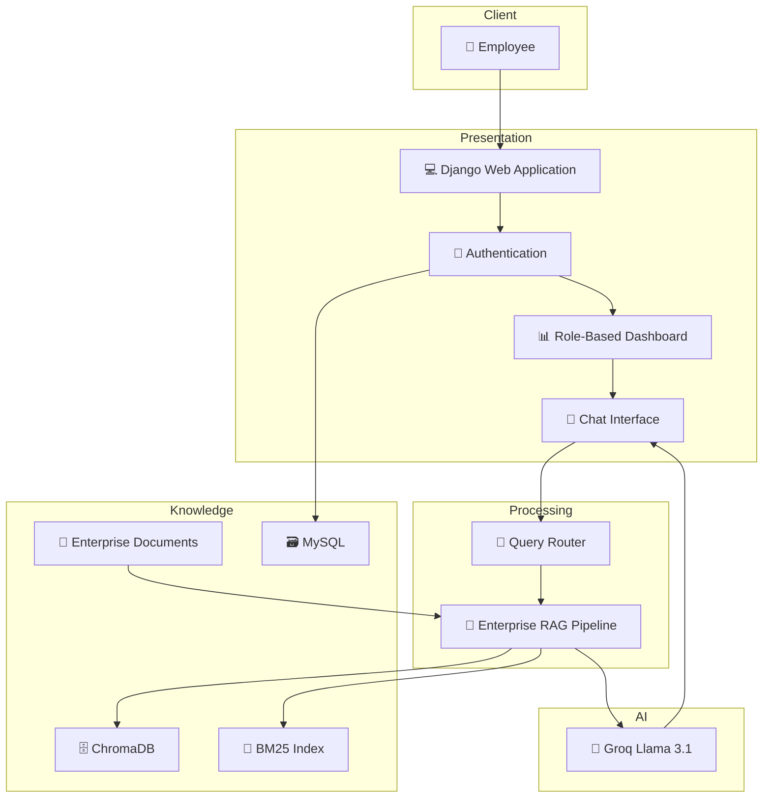
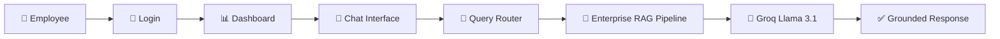
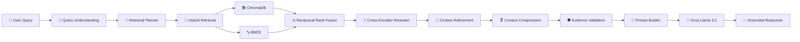
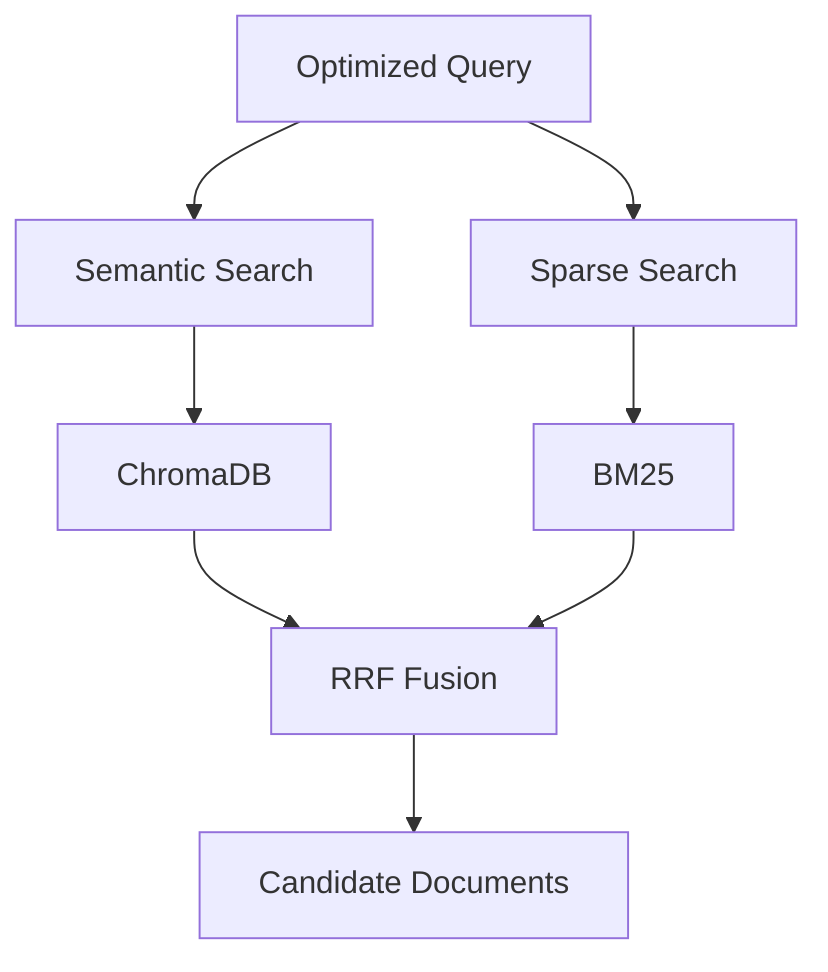
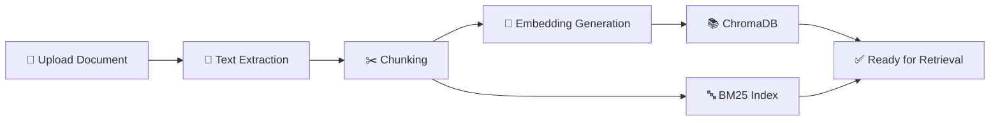
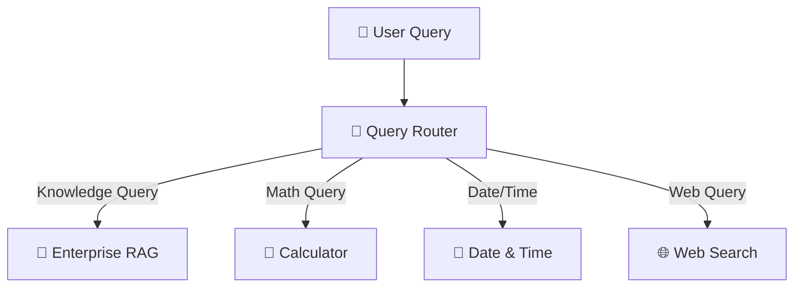
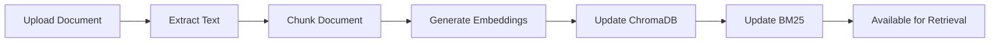

# 🚀 RAGLink – Enterprise AI Knowledge Hub

<p align="center">


</p>

---

## 📖 About RAGLink

**RAGLink** is an **Enterprise Retrieval-Augmented Generation (RAG)** platform that enables employees to interact with organizational knowledge using natural language.

Instead of manually searching through company policies, HR documents, technical manuals, infrastructure guides, and project documentation, users can simply ask questions through an AI-powered chat interface.

The system intelligently understands user queries, retrieves the most relevant information using **Hybrid Retrieval**, validates the retrieved evidence, and generates context-aware responses using **Groq Llama 3.1**.

Built with a modular architecture using **Django**, **LangChain**, **LangGraph**, **ChromaDB**, and **BM25**, RAGLink demonstrates how modern AI systems can be integrated into enterprise knowledge management.

---

# ✨ Features

### 🔐 Authentication

- Role-Based Authentication
- Admin Dashboard
- Team Lead Dashboard
- Employee Dashboard
- Secure Session Management

---

### 📄 Enterprise Knowledge Management

- Upload Enterprise Documents
- Manage Knowledge Base
- Automatic Document Processing
- Dynamic Document Indexing
- Enterprise Search

---

### 🧠 Query Understanding

- Query Rewriting
- Query Expansion
- Intent Classification
- Entity Extraction
- Entity Normalization
- Metadata Detection

---

### 🔍 Intelligent Retrieval

- Semantic Retrieval (ChromaDB)
- Sparse Retrieval (BM25)
- Hybrid Retrieval
- Reciprocal Rank Fusion (RRF)
- Cross-Encoder Reranking

---

### 🤖 Response Generation

- Context Refinement
- Context Compression
- Evidence Validation
- Prompt Construction
- Grounded Answer Generation

---

### ⚙️ Utility Tools

- Calculator
- Date Tool
- Time Tool
- Web Search
- Query Router

---

### 🚀 Performance

- Memory Cache
- Redis Cache
- LangGraph Workflow
- Modular Architecture
- Unit Testing

---

# 🎯 Problem Statement

Organizations store thousands of internal documents including

- Company Policies
- HR Guidelines
- Technical Documentation
- Infrastructure Manuals
- Employee Handbooks
- Project Documents
- Security Policies
- Standard Operating Procedures

Finding relevant information across these documents is often slow and inefficient.

Traditional keyword search returns many irrelevant results, forcing employees to manually inspect multiple documents.

**RAGLink solves this problem by combining Retrieval-Augmented Generation with Hybrid Retrieval to provide fast, reliable, and context-aware answers grounded in enterprise knowledge.**

---

# 🛠 Technology Stack

| Category | Technology |
|-----------|------------|
| **Programming Language** | Python 3.13 |
| **Backend Framework** | Django |
| **Frontend** | HTML5, CSS3, JavaScript |
| **Database** | MySQL |
| **Large Language Model** | Groq Llama 3.1 (Llama-3.1-8B-Instant) |
| **AI Framework** | LangChain |
| **Workflow Engine** | LangGraph |
| **Embedding Model** | HuggingFace Sentence Transformers (`all-MiniLM-L6-v2`) |
| **Vector Database** | ChromaDB |
| **Sparse Retrieval** | BM25 |
| **Hybrid Retrieval** | Reciprocal Rank Fusion (RRF) |
| **Reranking** | Cross-Encoder (`ms-marco-MiniLM-L-6-v2`) |
| **Caching** | Memory Cache, Redis Cache |
| **Document Processing** | PDF, DOCX, TXT Processing |
| **Testing** | Python `unittest` |
| **Version Control** | Git & GitHub |

---

# 🏛 Enterprise System Architecture


```mermaid
flowchart TB

subgraph Client
A["👤 Employee"]
end

subgraph Presentation
B["💻 Django Web Application"]
C["🔐 Authentication"]
D["📊 Role-Based Dashboard"]
E["💬 Chat Interface"]
end

subgraph Processing
F["🧭 Query Router"]
G["🧠 Enterprise RAG Pipeline"]
end

subgraph Knowledge
H["📄 Enterprise Documents"]
I["🗄️ ChromaDB"]
J["📑 BM25 Index"]
K["🗃️ MySQL"]
end

subgraph AI
L["🤖 Groq Llama 3.1"]
end

A --> B
B --> C
C --> D
D --> E
E --> F
F --> G
H --> G
G --> I
G --> J
C --> K
G --> L
L --> E
```

---

# 🔄 High-Level Workflow


```mermaid
flowchart LR

A["👤 Employee"]
B["🔐 Login"]
C["📊 Dashboard"]
D["💬 Chat Interface"]
E["🧭 Query Router"]
F["🧠 Enterprise RAG Pipeline"]
G["🤖 Groq Llama 3.1"]
H["✅ Grounded Response"]

A --> B
B --> C
C --> D
D --> E
E --> F
F --> G
G --> H
```

---

# 📌 Core Components

| Component | Purpose |
|-----------|---------|
| **Authentication** | Manages user login, roles, and access control. |
| **Chat Interface** | Provides an interactive interface for employees to ask questions. |
| **Query Router** | Routes queries to the RAG pipeline or utility tools. |
| **Enterprise RAG Pipeline** | Coordinates retrieval, ranking, and answer generation. |
| **Hybrid Retriever** | Combines semantic and keyword-based retrieval. |
| **Cross Encoder** | Reranks retrieved documents for improved relevance. |
| **Context Processor** | Refines and compresses retrieved information. |
| **Evidence Checker** | Validates supporting evidence before generation. |
| **Prompt Builder** | Constructs optimized prompts for the language model. |
| **Groq Llama 3.1** | Generates grounded responses using retrieved context. |
| **ChromaDB** | Stores vector embeddings for semantic search. |
| **BM25** | Performs sparse keyword-based retrieval. |
| **MySQL** | Stores application data, users, and metadata. |

---

# 📂 Project Organization

The project follows a layered, modular architecture that separates user management, document processing, retrieval, and response generation into independent components. This design improves maintainability, scalability, and extensibility while keeping each module focused on a specific responsibility.

```text
Presentation Layer
        │
        ▼
Authentication
        │
        ▼
Chat Interface
        │
        ▼
Query Router
        │
        ▼
Enterprise RAG Pipeline
        │
        ▼
Knowledge Retrieval
        │
        ▼
Response Generation
```


# 🧠 Enterprise RAG Pipeline

Unlike a traditional chatbot that directly sends user queries to a Large Language Model (LLM), **RAGLink** follows a multi-stage Retrieval-Augmented Generation (RAG) pipeline. Each stage improves the quality of retrieval and ensures that responses are grounded in enterprise knowledge rather than relying solely on the model's pre-trained information.

---

## 🔄 Complete RAG Workflow


```mermaid
flowchart LR

A["👤 User Query"]
B["🧠 Query Understanding"]
C["🎯 Retrieval Planner"]
D["🔎 Hybrid Retrieval"]
E["📚 ChromaDB"]
F["🔤 BM25"]
G["⚖️ Reciprocal Rank Fusion"]
H["🎯 Cross-Encoder Reranker"]
I["📑 Context Refinement"]
J["🗜️ Context Compression"]
K["🛡️ Evidence Validation"]
L["📝 Prompt Builder"]
M["🤖 Groq Llama 3.1"]
N["✅ Grounded Response"]

A --> B
B --> C
C --> D
D --> E
D --> F
E --> G
F --> G
G --> H
H --> I
I --> J
J --> K
K --> L
L --> M
M --> N
```

---

# 📖 Pipeline Stages

## 1️⃣ Query Understanding

The query is analyzed before retrieval to improve search quality.

### Responsibilities

- Query Rewriting
- Intent Classification
- Entity Extraction
- Entity Normalization
- Query Expansion
- Metadata Detection

### Example

**Input**

```text
Tell me about Meridian cloud.
```

↓

**Optimized Query**

```text
Explain the cloud infrastructure used in Project Meridian.
```

---

## 2️⃣ Intelligent Retrieval Planning

Instead of searching every document, RAGLink first determines **where** the query should search.

The Retrieval Planner identifies:

- Project Documents
- Company Policies
- HR Documents
- Infrastructure Guides
- Technical Documentation
- Metadata Filters

This reduces unnecessary retrieval and improves response accuracy.

---

## 3️⃣ Hybrid Retrieval

RAGLink combines two complementary retrieval strategies:

### 🔹 Semantic Retrieval

- Uses HuggingFace Embeddings
- Searches ChromaDB
- Finds semantically similar content

### 🔹 Sparse Retrieval

- Uses BM25
- Matches exact keywords
- Handles technical terms and abbreviations

Both retrieval results are merged using **Reciprocal Rank Fusion (RRF)**.

---

## Hybrid Retrieval Architecture


```mermaid
flowchart TB

A["Optimized Query"]

B["Semantic Search"]

C["Sparse Search"]

D["ChromaDB"]

E["BM25"]

F["RRF Fusion"]

G["Candidate Documents"]

A --> B
A --> C
B --> D
C --> E
D --> F
E --> F
F --> G
```

---

## 4️⃣ Cross-Encoder Reranking

The retrieved documents are scored using a Cross-Encoder model to identify the most relevant chunks.

### Benefits

- Better ranking quality
- Reduced irrelevant context
- Improved final answer accuracy

---

## 5️⃣ Context Processing

Before generation, the retrieved content is optimized.

### Context Refinement

- Removes duplicate chunks
- Cleans noisy text
- Orders information logically

### Context Compression

- Keeps only the most relevant content
- Reduces prompt size
- Improves response speed

---

## 6️⃣ Evidence Validation

Before sending the prompt to the LLM, RAGLink verifies that the retrieved evidence is sufficient.

If relevant evidence is unavailable, the system avoids hallucinations and informs the user that the requested information is not available in the enterprise knowledge base.

---

## 7️⃣ Prompt Construction

The Prompt Builder combines:

- User Query
- Retrieved Context
- System Instructions
- Safety Constraints

into a structured prompt for the language model.

---

## 8️⃣ Response Generation

The final prompt is passed to **Groq Llama 3.1**, which generates a grounded response using only the retrieved enterprise knowledge.

---

# 📄 Dynamic Document Ingestion

Administrators can upload new enterprise documents without rebuilding the entire knowledge base.

Whenever a document is uploaded, the system automatically:

1. Extracts text
2. Splits the document into chunks
3. Generates embeddings
4. Updates ChromaDB
5. Updates the BM25 index

The document becomes immediately searchable.

---

## Document Ingestion Workflow


```mermaid
flowchart LR

A["📄 Upload Document"]
B["📝 Text Extraction"]
C["✂️ Chunking"]
D["🧠 Embedding Generation"]
E["📚 ChromaDB"]
F["🔤 BM25 Index"]
G["✅ Ready for Retrieval"]

A --> B
B --> C
C --> D
D --> E
C --> F
E --> G
F --> G
```

---

# 🔀 Query Routing

Not every query requires the RAG pipeline.

The Query Router classifies incoming requests and forwards them to the appropriate module.

| Query Type | Destination |
|------------|-------------|
| Enterprise Knowledge | RAG Pipeline |
| Mathematical Expressions | Calculator Tool |
| Date & Time | Date/Time Tool |
| Web Queries | Web Search Tool |

---

## Query Router Workflow


```mermaid
flowchart TB

A["👤 User Query"]

B["🧭 Query Router"]

C["🧠 Enterprise RAG"]

D["🧮 Calculator"]

E["📅 Date & Time"]

F["🌐 Web Search"]

A --> B

B -->|Knowledge Query| C

B -->|Math Query| D

B -->|Date/Time| E

B -->|Web Query| F
```

---

# ⚡ Performance Optimizations

RAGLink includes several optimizations to improve retrieval efficiency and reduce response latency.

- 🧠 Memory Cache
- ⚡ Redis Cache
- 🔄 Dynamic Index Updates
- 🎯 Hybrid Retrieval
- 📊 Cross-Encoder Reranking
- 🗜️ Context Compression
- 🛡️ Evidence Validation

These optimizations ensure fast, scalable, and reliable enterprise question answering.

---
# 📂 Project Structure

RAGLink follows a **modular architecture**, where each module is responsible for a specific stage of the Retrieval-Augmented Generation (RAG) pipeline. This separation improves maintainability, scalability, and simplifies future enhancements.

```text
RAGLink
│
├── accounts/                      # User authentication & role management
│   ├── admin.py                   # Admin panel configuration
│   ├── forms.py                   # Authentication forms
│   ├── models.py                  # Custom User model
│   ├── urls.py                    # Authentication routes
│   ├── views.py                   # Login, logout & dashboard views
│   └── migrations/                # Database migrations
│
├── chatbot/                       # Chat interface & conversation management
│   ├── services.py                # Connects UI with the RAG pipeline
│   ├── views.py                   # Chat request handlers
│   ├── urls.py                    # Chat endpoints
│   └── models.py                  # Chat history
│
├── config/                        # Django project configuration
│   ├── settings.py                # Project settings
│   ├── urls.py                    # Root URL configuration
│   ├── wsgi.py                    # WSGI entry point
│   └── asgi.py                    # ASGI entry point
│
├── data/                          # Generated indexes and retrieval data
│   ├── bm25.pkl                   # BM25 index
│   ├── chunks.pkl                 # Stored document chunks
│   └── chroma_db/                 # Chroma vector database
│
├── documents/                     # Enterprise document management
│   ├── admin.py                   # Admin configuration
│   ├── forms.py                   # Upload forms
│   ├── models.py                  # Document model
│   ├── urls.py                    # Document routes
│   ├── views.py                   # Upload/Delete operations
│   └── migrations/
│
├── media/
│   ├── Company/                   # Company documents
│   └── Projects/                  # Project documents
│
├── rag/                           # Core Enterprise RAG System
│
│   ├── cache/                     # Memory & Redis caching
│   │   ├── memory_cache.py
│   │   └── redis_cache.py
│   │
│   ├── chunking/                  # Document chunking
│   │   └── chunker.py
│   │
│   ├── compression/               # Context compression
│   │   └── compressor.py
│   │
│   ├── embeddings/                # Embedding generation
│   │   └── embedding_model.py
│   │
│   ├── evaluation/                # Pipeline evaluation
│   │   └── metrics.py
│   │
│   ├── generation/                # Response generation
│   │   ├── citation.py
│   │   ├── context.py
│   │   ├── evidence_checker.py
│   │   ├── llm.py
│   │   └── prompt.py
│   │
│   ├── ingestion/                 # Document indexing
│   │   ├── document_indexer.py
│   │   ├── dynamic_ingestion.py
│   │   ├── index_manager.py
│   │   └── loader.py
│   │
│   ├── langgraph/                 # LangGraph workflow
│   │   ├── graph.py
│   │   ├── nodes.py
│   │   └── state.py
│   │
│   ├── query/                     # Query processing
│   │   ├── query.py
│   │   └── rewrite.py
│   │
│   ├── query_understanding/       # Query understanding
│   │   ├── entity_normalizer.py
│   │   ├── intent_classifier.py
│   │   ├── query_expander.py
│   │   └── query_understanding.py
│   │
│   ├── refinement/                # Context refinement
│   │   └── context_refiner.py
│   │
│   ├── retrieval/                 # Retrieval engine
│   │   ├── bm25.py
│   │   ├── hybrid.py
│   │   ├── rerank.py
│   │   ├── retrieval_planner.py
│   │   └── semantic.py
│   │
│   ├── tools/                     # Utility tools
│   │   ├── calculator.py
│   │   ├── date.py
│   │   ├── time.py
│   │   ├── web_search.py
│   │   ├── document_lookup.py
│   │   └── query_router.py
│   │
│   ├── vectorstore/               # ChromaDB interface
│   │   └── chroma.py
│   │
│   ├── config.py                  # Pipeline configuration
│   └── pipeline.py                # Main RAG pipeline
│
├── scripts/                       # Helper scripts
├── templates/                     # HTML templates
├── tests/                         # Unit tests
├── requirements/                  # Project dependencies
├── manage.py                      # Django entry point
└── README.md
```

---

# 📌 Module Overview

| Module | Responsibility |
|---------|----------------|
| **accounts** | Handles authentication, authorization, and role-based access control. |
| **chatbot** | Connects the user interface with the RAG pipeline and manages conversations. |
| **documents** | Uploads, stores, and manages enterprise documents. |
| **media** | Stores company and project documents used as the knowledge base. |
| **cache** | Improves performance using Memory and Redis caching. |
| **chunking** | Splits large documents into smaller chunks for retrieval. |
| **compression** | Reduces context size while preserving relevant information. |
| **embeddings** | Generates vector embeddings for semantic search. |
| **generation** | Builds prompts, validates evidence, and generates responses. |
| **ingestion** | Dynamically processes and indexes uploaded documents. |
| **langgraph** | Defines the workflow orchestration for the RAG pipeline. |
| **query** | Performs query rewriting and preprocessing. |
| **query_understanding** | Detects user intent, extracts entities, and expands queries. |
| **refinement** | Cleans and refines retrieved context before generation. |
| **retrieval** | Implements semantic search, BM25 retrieval, hybrid retrieval, and reranking. |
| **tools** | Provides utility tools such as calculator, date/time, and web search. |
| **vectorstore** | Handles storage and retrieval of embeddings using ChromaDB. |
| **tests** | Contains unit and integration tests for the project. |

---

# 🧠 Core RAG Modules

The `rag/` package is the heart of the application and is responsible for transforming enterprise documents into a searchable knowledge base.

### 📥 Ingestion
Processes uploaded documents by extracting text, splitting it into chunks, generating embeddings, and updating retrieval indexes.

### 🧠 Query Understanding
Analyzes user queries by identifying intent, extracting entities, rewriting queries, and expanding search terms.

### 🔍 Retrieval
Performs hybrid retrieval using semantic similarity (ChromaDB) and keyword search (BM25), followed by reranking.

### 📑 Context Processing
Refines and compresses retrieved information to remove irrelevant content and reduce prompt size.

### 🤖 Generation
Constructs optimized prompts, validates retrieved evidence, and generates grounded responses using Groq Llama 3.1.

### ⚡ LangGraph
Coordinates the end-to-end workflow by connecting each stage of the RAG pipeline into a structured execution graph.

# ⚙️ Installation & Setup

## Prerequisites

Before running the project, ensure the following are installed:

- Python 3.13+
- Git
- MySQL
- Groq API Key
- Virtual Environment (recommended)

---

## Clone the Repository

```bash
git clone https://github.com/Srisilpa/RagLink.git
cd RagLink
```

---

## Create a Virtual Environment

### Windows

```bash
python -m venv venv

venv\Scripts\activate
```

### Linux / macOS

```bash
python3 -m venv venv

source venv/bin/activate
```

---

## Install Dependencies

```bash
pip install -r requirements/requirements.txt
```

---

## Environment Variables

Create a `.env` file in the project root.

```env
GROQ_API_KEY=your_groq_api_key
SECRET_KEY=your_django_secret_key

DB_NAME=raglink
DB_USER=root
DB_PASSWORD=your_password
DB_HOST=localhost
DB_PORT=3306
```

---

## Apply Database Migrations

```bash
python manage.py makemigrations

python manage.py migrate
```

---

## Create an Admin User

```bash
python manage.py createsuperuser
```

---

## Start the Development Server

```bash
python manage.py runserver
```

Open your browser and visit

```
http://127.0.0.1:8000/
```

---

# 📚 Document Ingestion

The system automatically processes uploaded enterprise documents.

### Supported Formats

- PDF
- DOCX
- TXT

---

## Ingestion Workflow


```mermaid
flowchart LR

A["Upload Document"]

-->

B["Extract Text"]

-->

C["Chunk Document"]

-->

D["Generate Embeddings"]

-->

E["Update ChromaDB"]

-->

F["Update BM25"]

-->

G["Available for Retrieval"]
```

---

# 🧪 Testing

The project includes unit tests for different RAG components.

Run all tests

```bash
python -m unittest discover tests
```

Run a specific test

```bash
python -m unittest tests.test_pipeline
```

Example test coverage includes

- Document Ingestion
- BM25 Retrieval
- Hybrid Retrieval
- Query Understanding
- Generation Pipeline
- Complete RAG Pipeline

---

# 📈 Future Enhancements

The architecture is designed to support future extensions.

Planned improvements include:

- GraphRAG Integration
- Knowledge Graph Support
- Multi-modal RAG (Images & PDFs)
- Streaming Responses
- Voice Assistant
- Multi-language Support
- OCR for Scanned Documents
- Agentic Tool Calling
- Advanced Evaluation Metrics
- Source Citation Highlighting
- Conversation Memory
- Document Versioning
- Kubernetes Deployment
- CI/CD Pipeline
- Docker Compose Support

---

# 🤝 Contributing

Contributions are welcome!

To contribute:

1. Fork the repository.
2. Create a feature branch.

```bash
git checkout -b feature/new-feature
```

3. Commit your changes.

```bash
git commit -m "Add new feature"
```

4. Push the branch.

```bash
git push origin feature/new-feature
```

5. Open a Pull Request.

---

# 🌟 Highlights

✔ Enterprise-grade Django application

✔ Modular RAG Architecture

✔ Query Understanding Pipeline

✔ Intelligent Retrieval Planning

✔ Hybrid Retrieval (Semantic + BM25)

✔ Reciprocal Rank Fusion (RRF)

✔ Cross-Encoder Reranking

✔ Context Refinement

✔ Context Compression

✔ Evidence Validation

✔ Dynamic Document Ingestion

✔ ChromaDB Integration

✔ Groq Llama 3.1 Integration

✔ LangGraph Workflow

✔ Role-Based Authentication

✔ Memory & Redis Cache

✔ Unit Testing

✔ Extensible Architecture

---

# 👩‍💻 Author

**Sri Silpa**

**B.Tech Information Technology**

**Shri Vishnu Engineering College for Women**

GitHub: **https://github.com/Srisilpa**

---

# 📄 License

This project is licensed under the **MIT License**.

Feel free to use, modify, and distribute this project for educational and research purposes.

---

# 🙏 Acknowledgements

This project leverages several open-source technologies:

- Django
- LangChain
- LangGraph
- Groq
- ChromaDB
- HuggingFace
- BM25
- Python

Special thanks to the open-source community for providing the tools and frameworks that made this project possible.

---

<div align="center">

### ⭐ If you found this project useful, consider giving it a star on GitHub!

**Built with ❤️ using Django, LangChain, LangGraph, ChromaDB, BM25, and Groq Llama 3.1**

</div>
